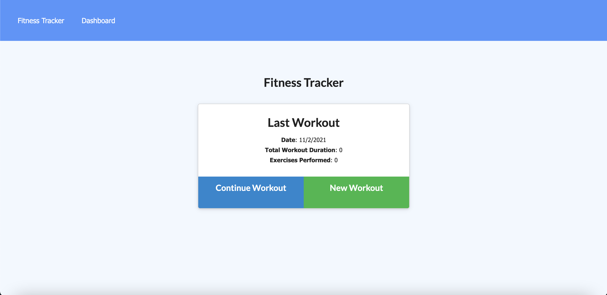

# Workout Tracker

## Workout Tracker Backend Description

This application is designed to assist workout enthusiasts in keeping track of workouts through the use of MongoDB and Express. By keeping track of workouts, weights, duration, and distances, workout enthusiasts can optimize their exercise performance and be more motivated. Recommended application to use is Heroku. Future development will prioritize a more friendly UI/UX and reduce repeated dates.

## Using application

To use this application, visit the deployed application: https://aqueous-mesa-97115.herokuapp.com

## Installing application

To install this application for development, either clone this repository or download directly through a zip file. Ensure you're running it on VS-Code. Make sure to use npm to install all necessary packages (morgan, mongodb, express). Start through using the "npm start".